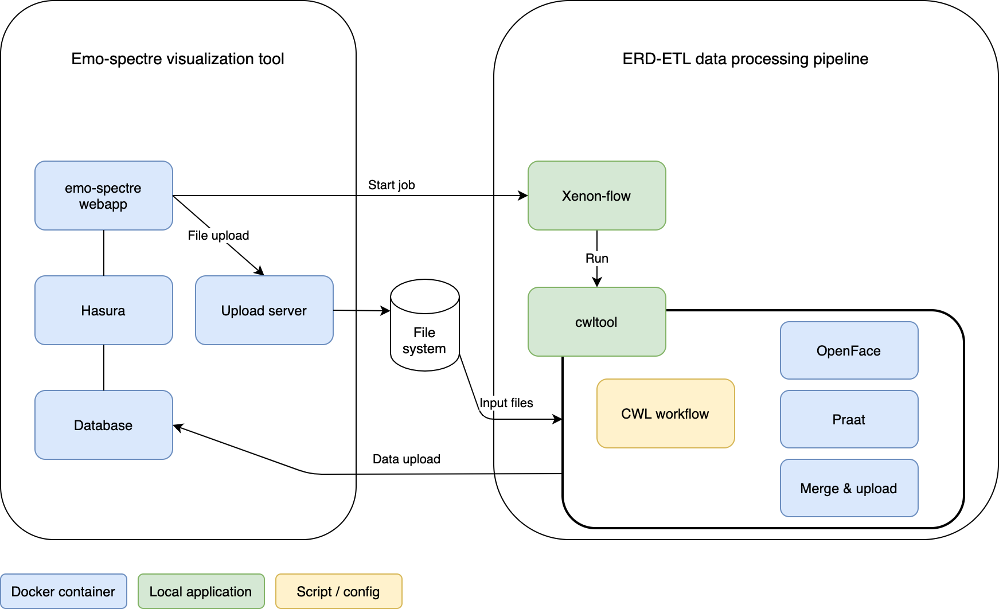

# Emo-spectre

A tool for visualizing and exploring multimodal features extracted from video.

## Deployment

The application consists of two major components: the visualization tool (emo-spectre + api + database) and the data processing pipeline (erd-etl + cwltool + xenonflow). The global architecture is outlined in this image:


TODO: update figure as xenonflow and cwltool are now running in a docker container and don't require local installation.

For production, the application can be launched as a set of Docker containers. For development, see below.

Clone these repositories:
* emo-spectre: https://github.com/emrecdem/emo-spectre
* erd-etl: https://github.com/emrecdem/erd-etl
* xenon-flow: https://github.com/emrecdem/xenon-flow and switch to the erd-changes branch.

### Configure emo-spectre

Change the api keys and passwords from their default, and make sure that they are matching between configuration files.

Edit the .env file:

```
XENON_API_KEY=in1uP28Y1Et9YGp95VLYzhm5Jgd5M1r0CKI7326RHwbVcHGa
XENONFLOW_HOME=/home/peter/xenonflow

DOCKER_NETWORK=emo-spectre_default

WEBAPP_PORT=3000
WEBAPP_HOST=localhost
WEBAPP_PROTOCOL=http

PRODUCTION_POSTGRES_USER=postgres
PRODUCTION_POSTGRES_PASSWORD=postgrespassword
PRODUCTION_HASURA_GRAPHQL_ADMIN_SECRET=adminpassword

ERD_ETL_PATH=/Users/peter/repos/esc/emrecdem/erd-etl

NODE_ENV=production
```

`ERD_ETL_PATH` points to the erd-etl repository, which is also used as the directory where the files for processing are stored. The upload server, xenonflow and cwltool will create/use some directories under `$ERD_ETL_PATH` for temporary storage, namely `upload`, `running-jobs`, `output` and `tmp`.

### Configure and build erd-etl

In erd-etl/merge_features.cwl, the database connection needs to be configured:

```
DB_CONNECTION: postgresql://postgres:<pwd>@<ip address of database container>:5432/postgres
```

**Build erd-etl**

This and below image are referred to by the CWL scripts that execute the data processing steps. They will be run by the Xenonflow container (as siblings).
```
cd scripts
docker build -t erd-etl .
cd ..
docker save erd-etl > erd-etl.tar
```

**Build erd-praat**
```
cd praat
docker build -t erd-praat
cd ..
docker save erd-praat > erd-praat.tar
```

### Configure and build xenon-flow

In xenon-flow/config/application.properties, edit the following:
* `xenonflow.http.auth-token` (should match XENON_API_KEY in emo-spectre/.env)
* `spring.datasource.password`
* `server.ssl.key-store-password`

Build xenon-flow:
```
docker build -t xenonflow .
```

## Start the docker containers

The command below executes two docker-compose files, one that launches Postgres and Hasura, the other launches Xenonflow, a simple upload server and the actual web application.

```
docker-compose -f docker-compose.yml -f docker-compose-production.yml up -d
```

**Initialize the database**
```
docker exec -i erd-postgres psql --username postgres postgres < ./sql/seed.sql
```
Note that the metadata for the Hasura container is auto-applied from ./hasura/metadata through the [cli-migrations Hasura image](https://hasura.io/docs/latest/graphql/core/migrations/config-v2/advanced/auto-apply-migrations.html#auto-apply-migrations-v2).

# Development

Requirements locally: `docker` and `yarn`.

## First time setup
```bash
yarn install
yarn dev
```
```shell
# on another terminal
make reset-db-to-defaults
yarn hasura-console #http://localhost:9596
```
## Development


```shell
yarn dev # http://localhost:3000
```
```shell
# On another terminal, open hasura console (Will track hasura metadata changes)
yarn hasura-console  # http://localhost:9596 Password sits inside docker compose, by default: 'adminpassword'
```
### To stop all docker containers you can use:
```bash
yarn stop
# or
docker-compose down
```

# Back up and restore Database

`docker-compose` needs to be running.

### Back up (Create Dump)

```shell
docker exec -it erd-postgres pg_dump -n public --username postgres postgres > ./CI/dev-data-dump.sql
```
### Restore PostgresDB data

#### Automatically with make
```shell
make reset-db-to-defaults
```
#### or run the commands manually 
Navigate to the folder containing the database dump and run psql from there.
```shell
docker exec -i erd-postgres psql --username postgres postgres < ./dump.sql
```
### Need clean up everything?
```shell
# delete completely the database:
docker exec -i erd-postgres dropdb -U postgres postgres
# Create it again
docker exec -i erd-postgres createdb -U postgres postgres
```
And then, import the data dump and apply the hasura metadata:
```shell
docker exec -i erd-postgres psql --username postgres postgres < ./CI/dev-data-dump.sql
yarn hasura-metadata-apply
```

# Running CWL Locally
## Install xenon-flow locally

You will need at least Java 11 and Python already in your machine

Clone the repository:
```
$ gh repo clone xenon-middleware/xenon-flow
$ pip install cwltool (you may need sudo permissions)

# Download all the dependecies for CWL with Gradle

./gradlew build
--
# Start the server
./gradlew bootRun
--
# Running at (Swagger):
open http://localhost:8080/

# admin
http://localhost:8080/admin/index.html
user: api-key
password: in1uP28Y1Et9YGp95VLYzhm5Jgd5M1r0CKI7326RHwbVcHGa
```
Making test api-calls:
- POST: 
-   url: http://localhost:8080/jobs
-   header: "api-key":"in1uP28Y1Et9YGp95VLYzhm5Jgd5M1r0CKI7326RHwbVcHGa"
-   body/json: {"name": "Workflow name test","workflow": "cwl/sleep.cwl","input": {"time": "3s"}}

Once the response is received: you can call again with GET
to the uri provided in the response.

Create a folder called cwl inside the xenon-flow folder (you got from cloning the repo) and place inside the `sleep.cwl` file you will find in the `CI` folder

Open `application.properties` file to disable ssl and choose the port (if needed it).
```shell
server.port=9050
server.ssl.enabled=false
```

Edit the xenon `config` file, change your local's folder to access the input files.
```shell
location: ${XENONFLOW_HOME}
```
